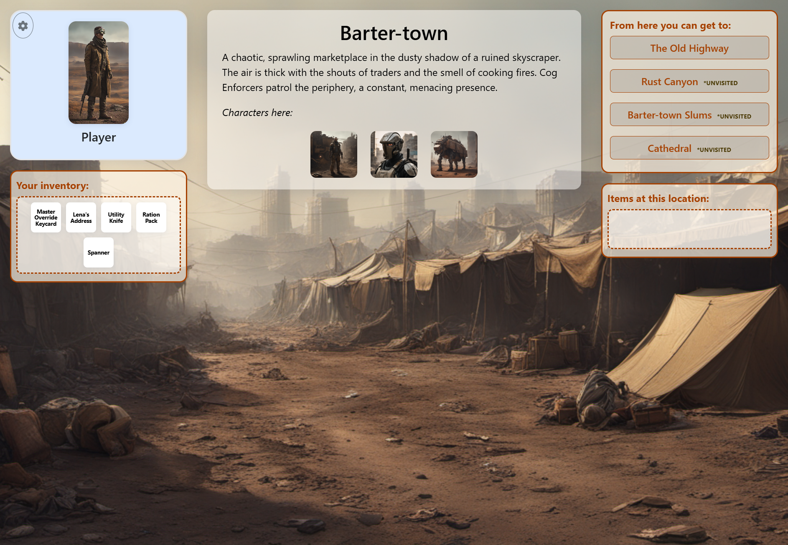
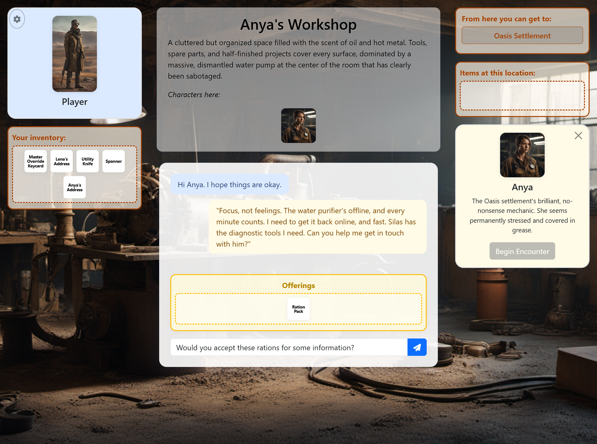

# Chatbot Adventure Game Training

An experimental framework for training and integrating Large Language Models (LLMs) with interactive game mechanics. This project serves as a testbed for exploring how fine-tuned chatbots can be seamlessly integrated with JavaScript-based game engines through structured interactions.

## Project Overview

This is **not a complete game** but rather a proof-of-concept and experimentation platform. The focus is on the intersection of:

- **LLM Fine-tuning**: Training language models to follow specific interaction patterns
- **Structured AI Responses**: Enforcing JSON-based action outputs from chatbot responses
- **Game Engine Integration**: Bridging AI responses with JavaScript game mechanics
- **System Prompt Engineering**: Crafting prompts that create consistent, game-appropriate AI behavior

## The Game Concept

The game concept centers around **AI-driven character interactions** within an easily customizable trading environment. Players navigate a world where every non-player character (NPC) is powered by fine-tuned language models, creating dynamic conversations that directly influence game mechanics through structured outputs.

Rather than scripted dialogue trees, characters respond naturally to player input while adhering to their programmed personas and the game's trading protocols. This concept serves as a practical demonstration of how LLMs can be trained to maintain character consistency, follow interaction rules, and generate actionable responses that seamlessly integrate with game systems.

**Current Development Status**: The game implementation is intentionally incomplete, serving as a foundational prototype rather than a finished product. Several gameplay areas remain underdeveloped, and the character interactions require substantial training refinement to achieve full coherence. The included training datasets represent an initial starting point designed to inspire further development rather than provide production-ready AI behavior. Significant additional work in training data curation, system prompt optimization, and model fine-tuning will be necessary to realize the full potential of this AI-driven gaming approach.

<div align="center">


*Figure 1: Main game interface showing character interaction, inventory management, and location-based gameplay*

<br><br>


*Figure 2: Real-time character dialogue demonstrating structured AI responses with JSON action outputs*

</div>

### Framework Features for AI Training

The interface demonstrates several key training concepts:

- **Structured Dialogue Management**: Characters maintain consistent personas and behavioral patterns as defined in their system prompts
- **Action-Based Interactions**: Every AI response concludes with parseable JSON actions (`{"give": [], "take": [], "attack": true}`) that drive game mechanics
- **Context Preservation**: Characters remember conversation history and maintain awareness of game state (inventory, location, relationships)
- **Constraint Adherence**: AI models learn to operate within specific rules (trading protocols, character limitations, world consistency)
- **Real-time Inference**: Live deployment environment for testing model behavior under actual user interactions

### Training Data Validation

The framework enforces strict conversation formats that teach models to:

- End responses with structured actions rather than continuing dialogue indefinitely
- Maintain character consistency across multiple conversation turns
- Respond appropriately to specific input patterns (e.g., `[OFFER: item_name]` triggers trading logic)
- Generate valid game actions that the JavaScript engine can interpret and execute

This interface serves as both a **testing ground** for newly trained models and a **demonstration** of how structured AI responses can seamlessly integrate with interactive systems.

## Key Components

### 1. Training Pipeline (`train_lora.py`)

- Fine-tunes LLMs using LoRA (Low-Rank Adaptation) for efficient training
- Processes training datasets with specific conversation formats
- Outputs adapter models that can be loaded into the base LLM

### 2. Dataset Validation (`scripts/validate_dataset.py`)

- Enforces strict formatting rules for training conversations
- Ensures all assistant messages end with structured JSON actions
- Validates that AI responses follow the `{"give": [], "take": [], ...}` format
- Supports arbitrary boolean flags for extensible game mechanics

### 3. Game Server (`servegame.py`)

- Flask-based API server that serves the game interface
- Loads fine-tuned LoRA adapters alongside base models
- Provides REST endpoints for real-time chatbot interactions
- Handles model inference with proper tokenization and generation parameters

### 4. JavaScript Game Engine (`game/`)

- Web-based interface for player interactions
- Parses structured JSON responses from the AI
- Implements game mechanics based on AI-generated actions
- Provides a framework for inventory, location, and character systems

## Experimentation Focus

This framework enables experimentation with:

### Model Training

- **Custom Datasets**: Create training conversations that teach specific behaviors
- **LoRA Adapters**: Efficient fine-tuning without modifying base model weights
- **Hyperparameter Tuning**: Experiment with different training configurations
- **Validation Pipelines**: Ensure data quality and format consistency

### System Prompt Engineering

- **Character Personas**: Define AI personalities through system prompts
- **Behavioral Constraints**: Enforce game rules and interaction patterns
- **Context Management**: Handle game state and world knowledge
- **Action Generation**: Guide AI to produce valid JSON actions

### Integration Patterns

- **Structured Outputs**: Force AI responses into parseable formats
- **Real-time Inference**: Handle live player interactions
- **State Synchronization**: Keep AI responses aligned with game state
- **Error Handling**: Manage malformed or unexpected AI outputs

## Getting Started

### Prerequisites

```bash
pip install -r requirements.txt
```

### Training a Model

1. Prepare your training data in the `training_data/` directory
2. Validate your dataset:

   ```bash
   python scripts/validate_dataset.py
   ```

3. Train a LoRA adapter:

   ```bash
   python train_lora.py
   ```

### Running the Game

```bash
python servegame.py path/to/your/lora_adapter
```

The server will start on `http://localhost:5000` with the game interface available.

## Dataset Format

Training conversations must follow this structure:

- Assistant messages end with `<|>{"give": [], "take": [], ...}`
- `give` and `take` arrays are always required (can be empty)
- Additional boolean properties are allowed (must be `true` when present)
- This format enables the JavaScript engine to parse and execute AI actions

## Architecture Benefits

This separation of concerns allows for:

- **Independent Model Development**: Train and test AI behaviors in isolation
- **Flexible Game Mechanics**: Modify JavaScript without retraining models
- **Rapid Iteration**: Test new interaction patterns quickly
- **Extensible Design**: Add new game features through boolean flags
- **Reproducible Experiments**: Version control for models, data, and prompts

## Use Cases

- Research into AI-driven game mechanics
- Prototyping conversational AI applications
- Exploring structured output generation from LLMs
- Testing fine-tuning approaches for specific domains
- Developing frameworks for AI-human interaction in games

## Future Directions

This framework provides a foundation for exploring:

- More complex action schemas
- Multi-character AI interactions
- Dynamic system prompt generation
- Advanced game state management
- Cross-session AI memory and learning

---

*This project is designed as an experimental platform. The game elements serve as a testbed for AI integration patterns rather than as a complete gaming experience.*
